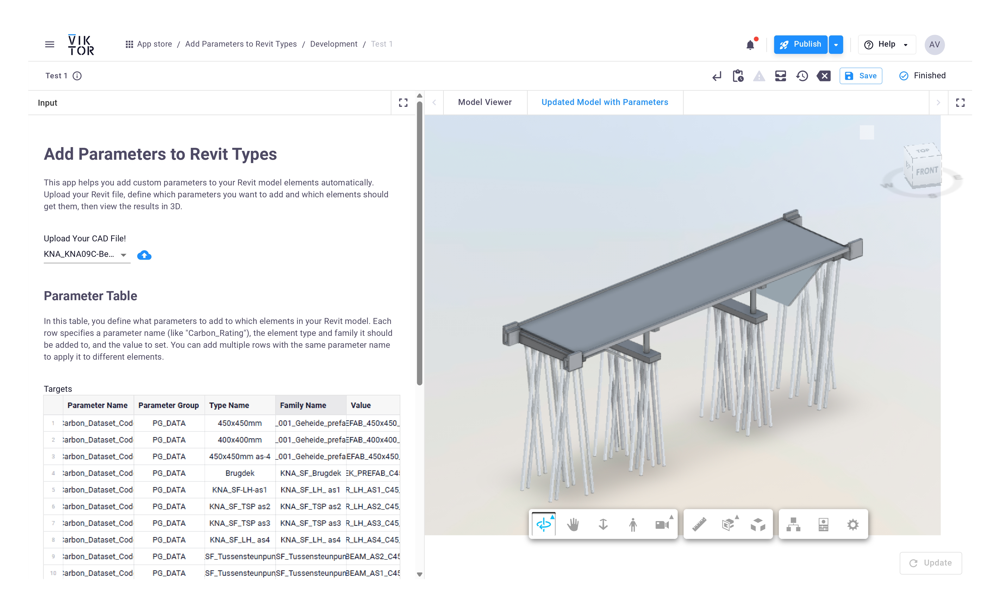

# Add Type Parameters to Revit - APS App



Automatically add custom parameters (like carbon data or ratings) to Revit model elements through a web interface.

## Quick Start

### 1. Set up APS Credentials

Create a `.env` file in the project root with your Autodesk Platform Services credentials:

```
CLIENT_ID=your_client_id_here
CLIENT_SECRET=your_client_secret_here
```

Get your credentials at: https://get-started.aps.autodesk.com/

### 2. Create the Design Automation Activity

Open and run the Jupyter notebook: `autodesk_automation/create_activity.ipynb`

### 3. Set up Viktor Account

The application runs on Viktor - create a free account at: https://docs.viktor.ai/docs/getting-started/installation/

## How to Use

1. Upload your Revit file
2. Fill in the parameter table with:
   - Parameter name (e.g., "Carbon_Rating")
   - Parameter group (PG_DATA, PG_TEXT, etc.)
   - Element type and family names
   - Values to assign
3. Choose a view:
   - **Model Viewer**: See your uploaded model
   - **Updated Model with Parameters**: Process and view the model with new parameters added

That's it!
